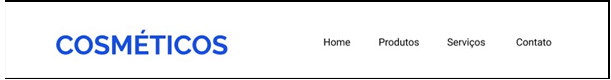
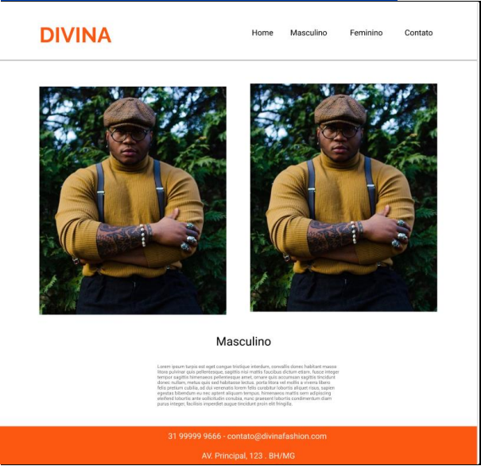
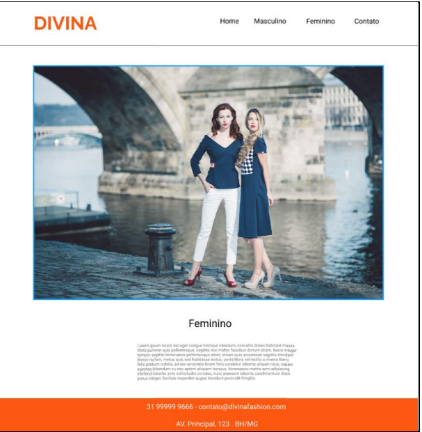
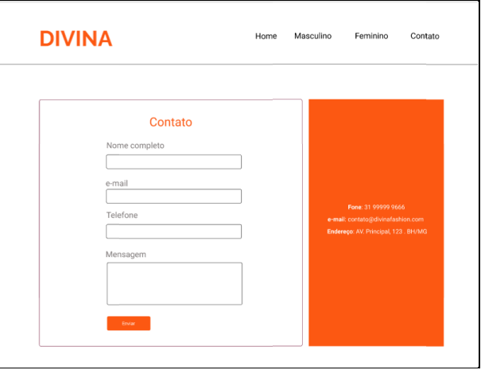

# Exercícios: Menus e Position

1- Crie o menu abaixo com o conhecimento adquirido até o momento:

2- Crie o menu abaixo com o conhecimento adquirido até o momento:

3- Crie o menu abaixo com o conhecimento adquirido até o momento

4- Crie a página home baseado no layout abaixo: 
**Imagens:**
[https//uploads.onsize.com.br/cndl/varejosa/2021/12/10081900/shutterstock_1074517280_menor-2-1140x450.jpg](https://uploads.onsize.com.br/cndl/varejosa/2021/12/10081900/shutterstock_1074517280_menor-2-1140x450.jpg)

[https://upload.wikimedia.org/wikipedia/commons/thumb/9/9f/Gisele_Bundchen_2018_clear_original_(cropped).jpg/300px-Gisele_Bundchen_2018_clear_original_(cropped).jpg](https://upload.wikimedia.org/wikipedia/commons/thumb/9/9f/Gisele_Bundchen_2018_clear_original_%28cropped%29.jpg/300px-Gisele_Bundchen_2018_clear_original_%28cropped%29.jpg)

**Nav:** 1140px
**Menu:** Roboto 24px color:#000000 largura: 560px
**Main:** 1140px 
**Card:** 300px X 593px
**Footer:** background-color #FC5812
**h1:** Roboto 36px #000000
**h2:** Roboto 24px #FC5812

**Botão saiba mais:** 128px X 42px color: #FC5812 border-radius: 4px

5 - Crie a página masculino baseado no layout abaixo: 
**Imagens:**
[https://i.pinimg.com/564x/8d/92/8d/8d928df3383bf9c81e51ef76820d4923.jpg](https://i.pinimg.com/564x/8d/92/8d/8d928df3383bf9c81e51ef76820d4923.jpg)

**Nav:** 1140px
**Menu:** Roboto 24px color:#000000 largura: 560px
**Main:** 1140px 
**Footer:** background-color #FC5812
**h1:** Roboto 36px #000000
**Texto “Masculino”:** largura 550px

6 - Crie a página feminino baseado no layout abaixo: 
Imagens:
[https://upload.wikimedia.org/wikipedia/commons/thumb/f/fd/LJ7A3094-2.jpg/1200pxLJ7A3094-2.jpg](https://upload.wikimedia.org/wikipedia/commons/thumb/f/fd/LJ7A3094-2.jpg/1200pxLJ7A3094-2.jpg)

**Nav:** 1140px
**Menu:** Roboto 24px color:#000000 largura: 560px
**Main:** 1140px 
**Footer:** background-color #FC5812
**h1:** Roboto 36px #000000
**Texto “Feminino”:** largura 550px

7 - Crie a página contato baseado no layout abaixo:

**Nav:** 1140px
**Menu:** Roboto 24px color:#000000 largura: 560px
**Main:** 1140px 
**Lado esquerdo - Formulário:** 780px X 730px 
**Lado direito - Endereço:** 400px X 730px: background-color #FC5812 Roboto 18px 
**h1:** Roboto 36px #FC5812 
**Inputs:** 400px X 42px border-radius: 4px
**Textarea:** 400px X 125px border-radius: 4px
**Botão:** 128px X 42px border-radius: 4px background-color #FC5812

8 - Monte um pequeno website conectando todas as páginas criadas nos exercícios
anteriores: **Home, Masculino, Feminino e Contato**, através de links internos, gerando a
navegabilidade.
